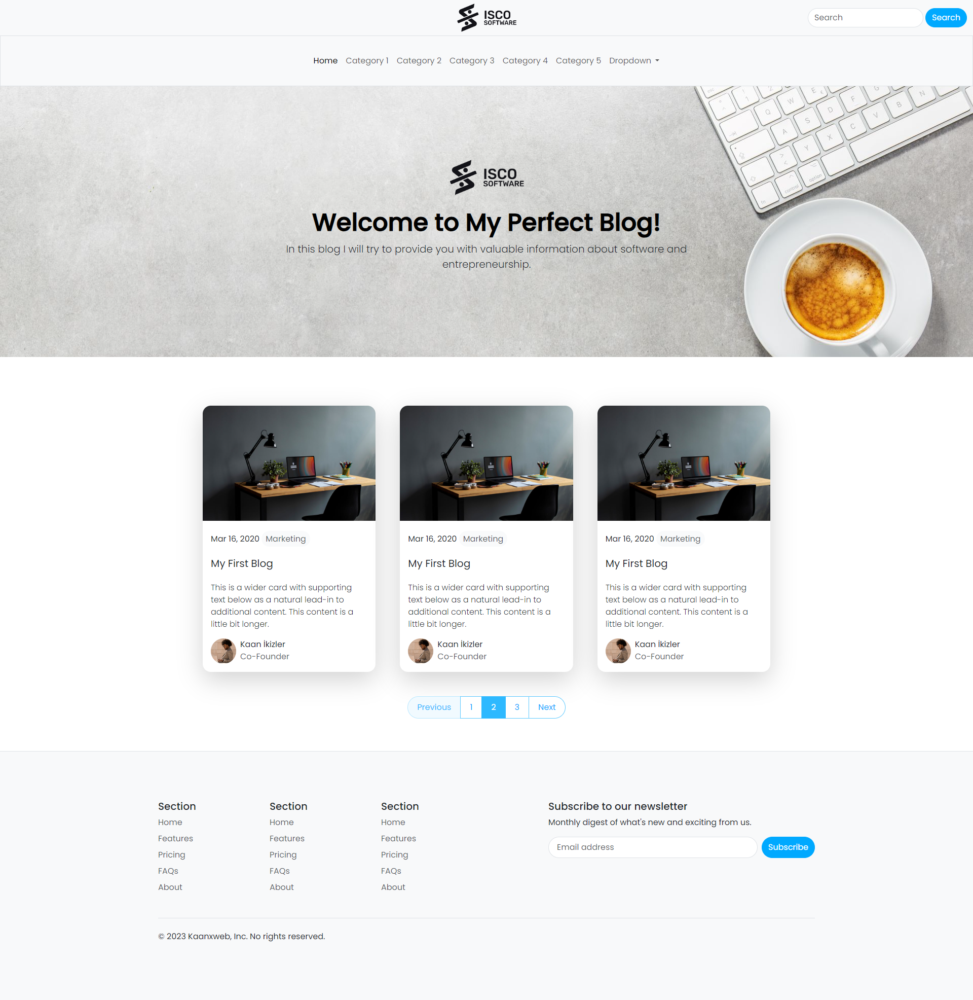

# XWEB Blog Template

Welcome to the XWEB Blog Template - a modern, responsive blog template designed for effortless blogging experiences. This template is ideal for bloggers, journalists, or anyone looking to create a professional blog with ease.



## Features

- **Responsive Layout**: Ensures a perfect viewing experience across all devices.
- **Modern Design**: A clean and contemporary look to keep your readers engaged.
- **Intuitive Navigation**: User-friendly navigation for a seamless browsing experience.

## Pages

- `index.html`: The homepage displaying blog posts in a well-organized manner.
- `blog-detail.html`: A detailed page for individual blog posts, enhancing the reading experience.
- `login.html`: A login page for users to access their accounts securely.
- `register.html`: A registration page for new users to create their accounts.
- `profile-edit.html`: A profile edit page for edit profile.

## Technologies Used

- **HTML**: Clean and semantic markup for content structuring.
- **CSS**: Custom styling focused on a modern and visually appealing design.
- **Bootstrap 5.3**: Leveraged for its responsive features and design components.

## Getting Started

1. Clone the repository:
   ```bash
   git clone https://github.com/kaanxweb/simple-blog.git

## Customization
You can easily customize the template to fit your personal or branding needs by modifying the HTML and CSS files. Use the Bootstrap framework to adjust layouts and components effortlessly.

## Contribution
Contributions to improve XWEB Blog Template are always welcome. Please ensure to follow the contribution guidelines when submitting any changes.

## License
This project is released under the MIT License.

## Contact
For questions or suggestions regarding XWEB Blog Template, feel free to reach out at kaanxweb@hotmail.com

Happy Blogging with XWEB Blog Template!


